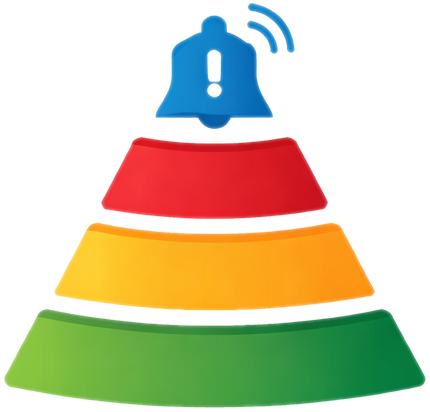

  

# ExSpire

Track things before they expire. Add subscriptions, documents, warranties, memberships, and more with expiry dates, then get reminders before they lapse.

Items are displayed in a spire layout — the closest to expiring sit at the narrow top, widening as deadlines stretch further out.

## Features

- **Tower view** — items stacked by urgency with color-coded expiry indicators (red for imminent, yellow for soon, green for safe)
- **Categories** — built-in presets (subscription, document, warranty, membership, insurance, domain, license) plus custom categories
- **Recurring items** — set items to repeat weekly, monthly, or yearly. When they expire, the next occurrence is auto-created with reset notifications
- **Email reminders** — get notified a configurable number of days before an item expires
- **Push notifications** — browser push via Web Push, with a test button to verify setup
- **Search and filter** — filter by category or search by name to find items quickly
- **Dark and light mode** — toggle in settings, defaults to dark
- **Spire alignment** — align the spire left, center, or right
- **Show/hide recurring** — toggle recurring items on or off in the spire (off by default)
- **Paginated spire** — shows 21 items at a time with a "Show more" button
- **Mobile gestures** — swipe left on items to reveal edit/delete actions, pull down to refresh
- **Account management** — change password, delete account, email verification
- **PWA support** — installable as a standalone app on mobile and desktop

## How It Works

1. Create an account with your email and password
2. Add items with a name, category, expiry date, and optional notification settings
3. Your spire builds itself — items closest to expiring are at the top
4. Get email or push reminders before things lapse
5. Recurring items auto-renew when they expire, so you never lose track

## Security

- Passwords are hashed with bcrypt (12 rounds)
- Auth tokens expire after 30 days
- Rate limiting on login, signup, and password reset (5 attempts per 15 minutes)
- All inputs are validated and sanitized server-side

## Contributing

ExSpire is source-available — the code is public for viewing and contributions, but redistribution and commercial use require permission from the copyright holder.

Contributions are welcome — feel free to open issues or submit pull requests on [GitHub](https://github.com/meduseld-io/exspire).

ExSpire is developed and maintained by [@quietarcade](https://github.com/quietarcade) as part of [Meduseld](https://github.com/meduseld-io).

## License

Source Available — see [LICENSE](LICENSE).
